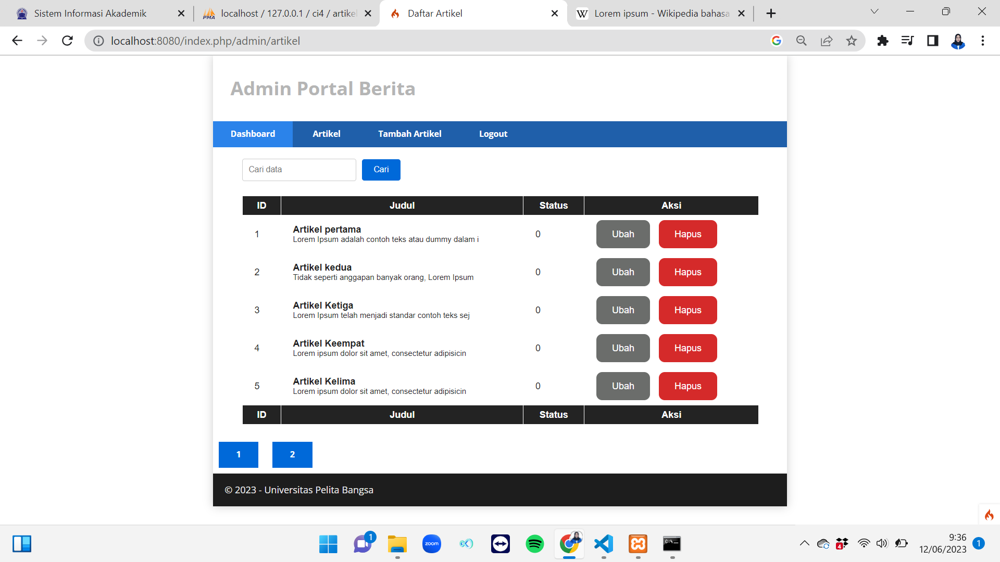
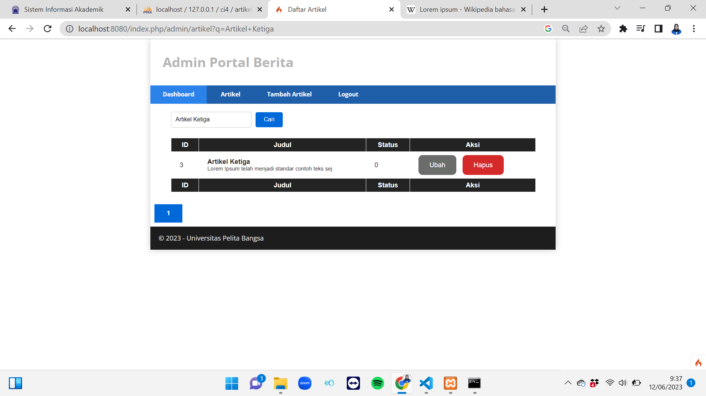

# Pemograman Web 2
## Profil
| #               | Biodata           |
| --------------- | ----------------- |
| **Nama**        | Zhafira A. K      |
| **NIM**         | 312110067         |
| **Kelas**       | TI.21.A.1         |
| **Mata Kuliah** | Pemrograman Web 2 |

# Langkah-langkah & Persiapan
## Membuat Pagination
<p>Pagination merupakan proses yang digunakan untuk membatasi tampilan yang panjang
dari data yang banyak pada sebuah website. Fungsi dari pagination adalah memecah tampilan
menjadi beberapa halaman tergantung banyaknya data yang akan ditampilkan pada
setiap halaman.</p>
<p>Pada Codeigniter 4, fungsi pagination sudah tersedia pada Library sehingga cukup mudah
menggunakannya.</p>

- Untuk membuat pagination, buka kembali Controller Artikel, kemudian modifikasi kode pada method admin_index seperti berikut.

```php
public function admin_index()
{
$title = 'Daftar Artikel';
$model = new ArtikelModel();
$data = [
'title' => $title,
'artikel' => $model->paginate(10), #data dibatasi 10 record
per halaman
'pager' => $model->pager,
];
return view('artikel/admin_index', $data);
}
```

- Kemudian buka file views/artikel/admin_index.php dan tambahkan kode berikut dibawah deklarasi tabel data.

```php
<?= $pager->links(); ?>
```

- Selanjutnya buka kembali menu daftar artikel, tambahkan data lagi untuk melihat hasilnya.



## Membuat Pencarian

- Untuk membuat pencarian data, buka kembali Controller Artikel, pada method admin_index ubah kodenya seperti berikut.

```php
    public function admin_index()
    {
        $title = 'Daftar Artikel';
        $q = $this->request->getVar('q') ?? '';
        $model = new ArtikelModel();
        $data = [
            'title' => $title,
            'q' => $q,
            'artikel' => $model->like('judul', $q)->paginate(5), # data dibatasi 10 record per halaman
            'pager' => $model->pager,
        ];
        return view('artikel/admin_index', $data);
    }
```

- Kemudian buka kembali file views/artikel/admin_index.php dan tambahkan form pencarian sebelum deklarasi tabel seperti berikut:

```php
  <form method="get" class="form-search">
    <input type="text" name="q" value="<?= $q; ?>" class="text-search" placeholder="Cari data">
    <input type="submit" value="Cari" class="submit-search">
  </form>
```

- Dan pada link pager ubah seperti berikut.

```php
<?= $pager->only(['q'])->links(); ?>
```

- Selanjutnya uji coba dengan membuka kembali halaman admin artikel, masukkan kata kunci tertentu pada form pencarian.




## Terima Kasih
